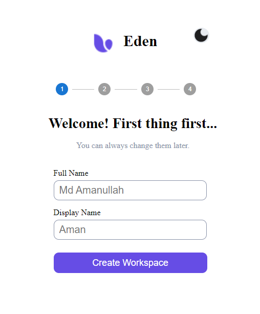
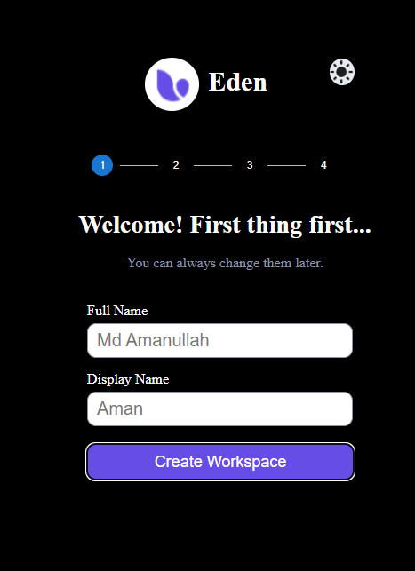
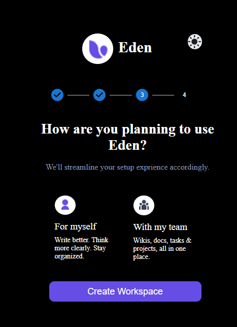
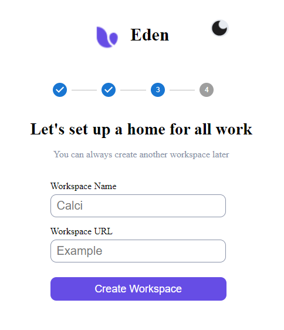
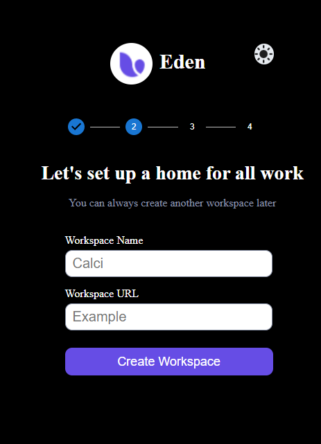
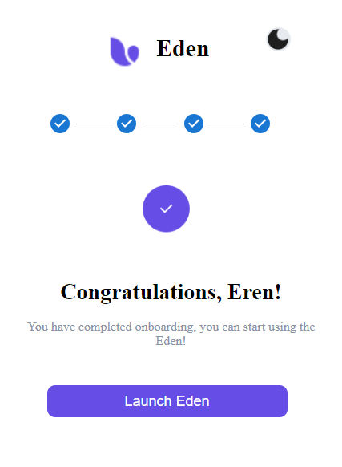

# Eden Onboarding Process

  
## Tech Stacks Used

- **React Js**
- **Style Components**
- **MUI**

###  Welcome Page Light Mode 

It is Landing Page and Welcome page

  
 

### Welcome Page Dark Mode

  

### Some Screenshot

  
  
  
  
 

###  Project Code Link 
- Github: [Project Code Link](https://github.com/Amanullah21/Onboarding)
 

###  Live Project Link   
- Eden: [Live Project Link](https://62fe533bd81a3b479ec1f1bb--lively-klepon-aba9a2.netlify.app/)
 
 

## Contributers

👤 **MD Amanullah**

- Github: [MD Amanullah](https://github.com/Amanullah21)
- Linkedin: [MD Amanullah](https://www.linkedin.com/in/amanullah21/)
